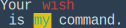
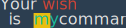

# svg-readme-experiments

> scratch-pad for svg readme experiments


## SVG over Raster - Pros and Cons

**Pros**

- SVG string more versionable than raster
- SVG smaller files-ize than raster
- No loss of color-space or luma-space during compression 
- Looks good at large resolutions
- Looks sharper than PNG/JPG at regular resolutions

**Cons**

- You will need 'SourceCodePro Nerd Font', etc, to see powerline output correctly

## Small Test

SVG



iTerm2 Screenshot (zoomed in)


## Powerline Compatibility

SVG Output - (1k)


PNG Screenshot from iTerm2 - (\~88k @ \~retina-res: \~2800x\~140px)


## Emoji Compatibility


## All Styles


## No Font in SVG

Attempting to provide font around SVG. WIll not work as SVG is an image tag.

```html
<font face="Courier" size="14px"></font>
```

<font face="Courier" size="14px"></font>

```html
<span style="font-family: Courier; font-size: 14px;"></span>
```

<span style="font-family: Courier; font-size: 14px;"></span>
	
